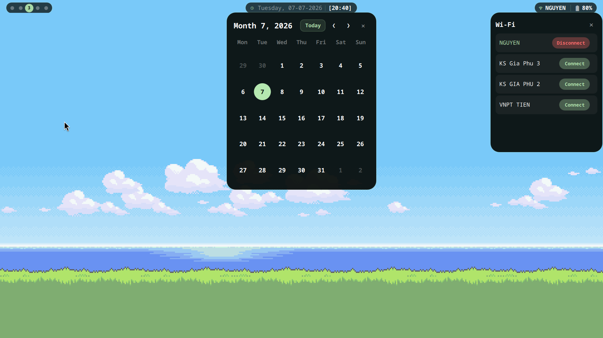
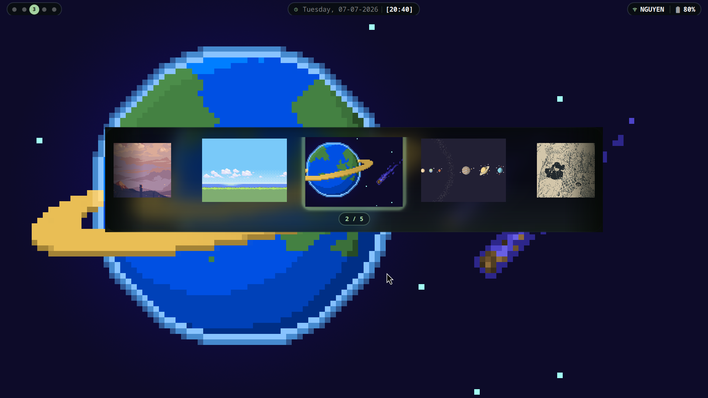
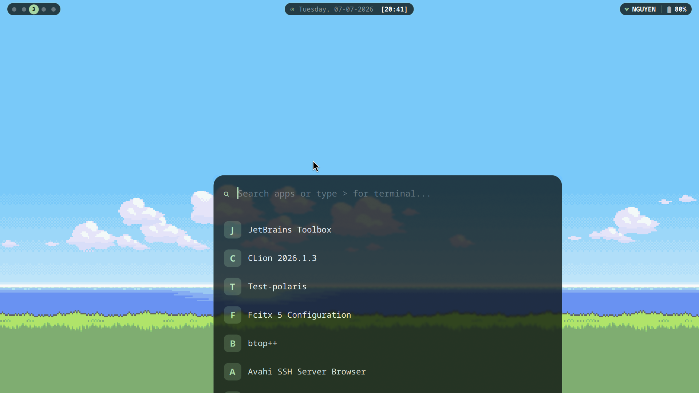
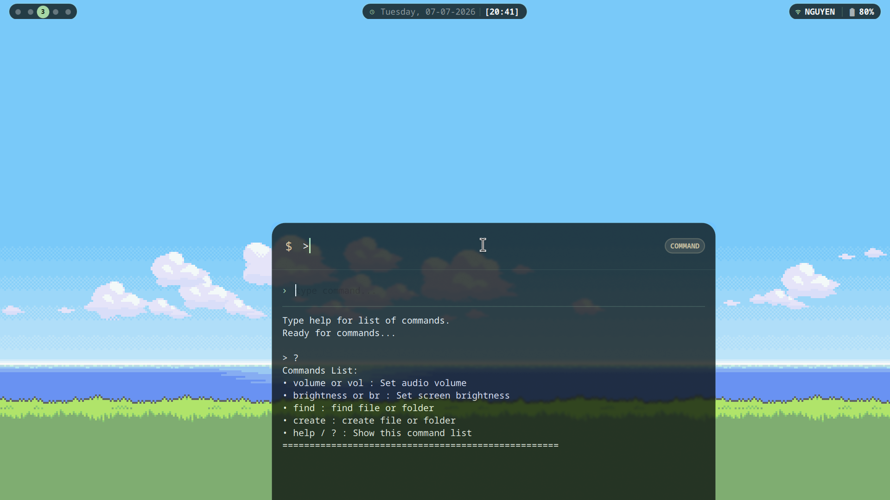
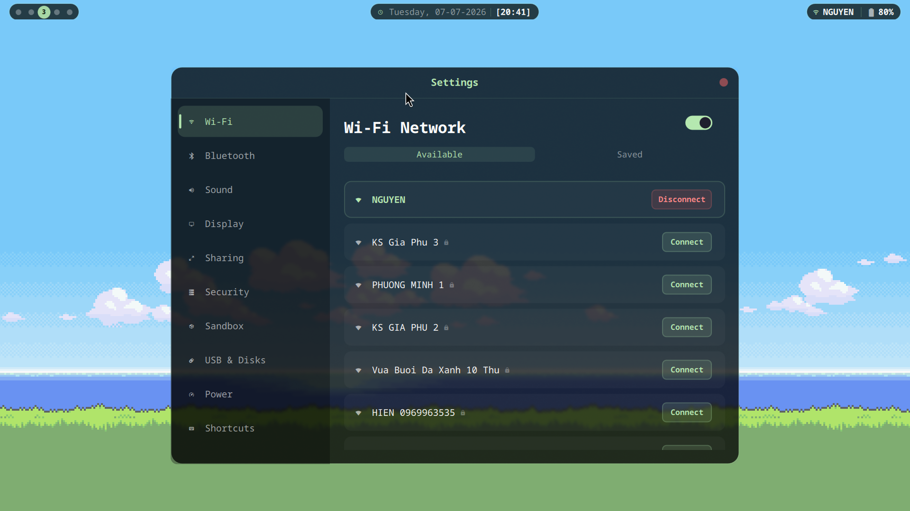

# Polaris Desktop Environment

A lightweight Desktop Environment shell built from scratch with **C++23** and **Qt6/QML**,
targeting **Hyprland/Wayland**. Polaris is designed as a daily-driver DE replacement
and a portfolio project demonstrating real-world Qt6 application development.

---

## Screenshots
- taskbar
  
- dynamic wallpaper change
  
- launcher
  
- terminal launcher
  
- Setting panel
  

## Modules

Polaris is split into independent executables — each module is a separate process:

| Module | Description |
|--------|-------------|
| `polaris_launcher` | App launcher with fuzzy search and built-in command interpreter |
| `polaris_taskbar` | System tray bar pinned to screen via Wayland layer-shell |
| `polaris_settings` | Settings panel with MVP core, Sandbox isolation, and dynamic Update Manager |

---

## Features

### Launcher
- Reads installed applications from `.desktop` files (XDG standard)
- Real-time search/filter via `QSortFilterProxyModel`
- Launches apps via `QProcess`
- **Built-in Command Interpreter** — custom shell commands:
    - `volume <0-100>` — set audio volume via PipeWire/PulseAudio
    - `brightness <0-100>` — set screen brightness via brightnessctl
    - `find <term>` — fast file search via `fd`
    - `create <path>` — create files/folders directly from launcher
    - `help` — list all available commands

### Taskbar
- Pinned to screen edge via **Wayland layer-shell protocol** (LayerShellQt)
- Real-time system info:
    - Clock & Date — updates every minute
    - Battery — reads from `/sys/class/power_supply/`
    - Wifi — NetworkManager integration via `nmcli`
    - Workspace Indicator — real-time Hyprland IPC via socket
- **Wifi Popup Window** — scan nearby networks, connect/disconnect, password input

### Settings (New!)
- **Dynamic Scrollable Navigation** — built with a `Flickable` viewport and Qt6 vertical scrollbar integration to support 11+ system modules without vertical window overflow.
- **MVP Agile Architecture** — prioritized production core supporting immediate system needs (`Wi-Fi`, `Bluetooth`, `Sound`, `Display`, and `About`), while utilizing a modular `ComingSoon` fallback view with breathing icon animations for advanced tabs under development.
- **Application & File Isolation (Sandbox)**:
    - Interfaces with Linux containment engines (`firejail` / `bubblewrap`) to isolate high-risk applications (e.g., Web Browsers, P2P Clients).
    - **Dynamic App Rules**: Custom `ListModel` allowing real-time permission toggles and custom process addition via an interactive modal popup (`TextField` with native placeholder support).
    - **Untrusted Binaries Injection**: Dedicated path testing arena allowing execution of unverified scripts or dangerous binaries (e.g., `rm -rf /` sandbox testing) without host machine compromise.
- **Smart System Update Manager**:
    - 3-tier reactive state engine (`idle` -> `checking` -> `available`) with smooth Nerd Font rotation animations (`󰑐`).
    - Synchronizes both upstream OS repositories (`CachyOS` / `Arch Linux` via `pacman -Sy`) and custom Polaris DE modules simultaneously.
    - Triggers native system authorization (`pkexec` / `sudo pacman -Syu`) upon user confirmation.
- **Support & Monetization Integration** — built-in glassmorphism modal popup displaying localized payment QR codes to support open-source development and free knowledge creation.

---

## Architecture

Polaris follows a strict **C++ Backend / QML Frontend** separation:

```
┌─────────────────────────────────────────────┐
│                  QML Layer                  │
│   (UI, animations, layout, user interaction)│
│                                             │
│  main.qml → components/*.qml                │
└──────────────────┬──────────────────────────┘
│  Q_PROPERTY (data binding)
│  Q_INVOKABLE (method calls)
│  Signals/Slots
┌──────────────────┴──────────────────────────┐
│               C++ Backend Layer             │
│   (system data, business logic, APIs)       │
│                                             │
│  AppModel       → reads .desktop files      │
│  BatteryManager → reads /sys/class/         │
│  WifiManager    → calls nmcli               │
│  ClockManager   → QDateTime + QTimer        │
│  WorkspaceManager → Hyprland IPC socket     │
│  CommandInterpreter → custom shell commands │
│  SandboxEngine  → calls firejail / bwrap    │
│  UpdateManager  → calls pacman / paru       │
└──────────────────┬──────────────────────────┘
│
┌──────────────────┴──────────────────────────┐
│                 System Layer                │
│                                             │
│  Wayland / layer-shell protocol             │
│  Linux sysfs (/sys/class/power_supply/)     │
│  NetworkManager (nmcli)                     │
│  Hyprland IPC ($XDG_RUNTIME_DIR/hypr/)      │
│  PipeWire/PulseAudio (pactl)                │
│  Containment Engines (firejail / bubblewrap)│
│  Arch Package Manager (pacman / libalpm)    │
└─────────────────────────────────────────────┘
```
### Key Design Decisions

**Why Qt6/QML?**
Qt6/QML is the industry standard for automotive HMI (Human-Machine Interface)
development — used by Mercedes, BMW, Volvo for in-car infotainment systems.
Building a real DE with Qt6 directly mirrors the tech stack used in production
automotive software.

**Why separate executables per module?**
Each component (launcher, taskbar) has a different lifecycle:
- Taskbar runs continuously as a layer-shell surface
- Launcher spawns on-demand via keybind

**Why Wayland layer-shell?**
Regular windows are managed by the compositor (Hyprland) — position, opacity,
and z-order can be overridden. Layer-shell gives Polaris direct control over
its own rendering without compositor interference, enabling true transparency,
precise positioning, and always-on-top behavior.

**Why custom CommandInterpreter instead of alias?**
Aliases go through shell parsing overhead. Polaris CommandInterpreter calls
system APIs directly from C++ — no shell spawning, no alias lookup,
faster execution.

---

## Tech Stack

- **Language**: C++23, QML (Qt Quick)
- **Framework**: Qt6 — QtCore, QtGui, QtQml, QtQuick, QtDBus
- **Wayland**: LayerShellQt (layer-shell protocol binding for Qt)
- **Build System**: CMake 3.20+
- **Target**: Hyprland / any wlr-layer-shell compatible Wayland compositor

---

## Building

### Dependencies
```bash
# Arch/CachyOS
paru -S qt6-base qt6-declarative qt6-wayland layer-shell-qt mako fastfetch kitty
# Optional
paru -S brightnessctl fd firejail bubblewrap
```

### Build
```bash
git clone [https://github.com/NarieWynn/Polaris_DE](https://github.com/NarieWynn/Polaris_DE)
cd Polaris
cmake -B cmake-build-release -DCMAKE_BUILD_TYPE=Release
cmake --build cmake-build-release
```
(Note: During the CMake configuration phase, embedded
deployment symbolic links will automatically link
Polaris's bundled dotfiles for Kitty and Fastfetch
into your ~/.config/ path if they do not already exist).
### Run
```bash
# Start Notification Daemon
mako &
# Taskbar (add to Hyprland autostart)
./cmake-build-release/modules/taskbar/polaris_taskbar

# Launcher (bind to a key in Hyprland)
./cmake-build-release/modules/launcher/polaris_launcher

# Settings Panel
./cmake-build-release/modules/settings/polaris_settings
```

---

```
Polaris/
├── CMakeLists.txt
├── dotfiles
│   ├── fastfetch
│   │   └── config.jsonc
│   ├── kitty
│   │   └── kitty.conf
│   └── mako
│       └── config
├── modules
│   ├── launcher
│   │   ├── CMakeLists.txt
│   │   ├── qml
│   │   │   ├── components
│   │   │   │   ├── AppLauncher.qml
│   │   │   │   └── SearchBar.qml
│   │   │   └── main.qml
│   │   └── src
│   │       ├── appmodel.cpp
│   │       ├── appmodel.h
│   │       ├── commandinterpreter.cpp
│   │       ├── commandinterpreter.h
│   │       └── main.cpp
│   ├── osd
│   │   ├── CMakeLists.txt
│   │   ├── qml
│   │   │   └── main.qml
│   │   └── src
│   │       └── main.cpp
│   ├── settings
│   │   ├── CMakeLists.txt
│   │   ├── qml
│   │   │   ├── components
│   │   │   │   ├── AboutSettings.qml
│   │   │   │   ├── BluetoothSettings.qml
│   │   │   │   ├── ComingSoon.qml
│   │   │   │   ├── DisplaySettings.qml
│   │   │   │   ├── FirewallSettings.qml
│   │   │   │   ├── PowerSettings.qml
│   │   │   │   ├── SandboxSettings.qml
│   │   │   │   ├── SharingSettings.qml
│   │   │   │   ├── ShortcutsSettings.qml
│   │   │   │   ├── SoundSettings.qml
│   │   │   │   ├── UsbSettings.qml
│   │   │   │   ├── WifiButton.qml
│   │   │   │   └── WifiSettings.qml
│   │   │   └── main.qml
│   │   └── src
│   │       └── main.cpp
│   ├── taskbar
│   │   ├── CMakeLists.txt
│   │   ├── qml
│   │   │   ├── components
│   │   │   │   ├── Battery.qml
│   │   │   │   ├── CalendarView.qml
│   │   │   │   ├── Clock.qml
│   │   │   │   ├── DateDisplay.qml
│   │   │   │   ├── WifiIndicator.qml
│   │   │   │   ├── WifiPopup.qml
│   │   │   │   └── WorkspaceIndicator.qml
│   │   │   ├── main.qml
│   │   │   ├── CalendarPopupWindow.qml
│   │   │   └── WifiPopupWindow.qml
│   │   └── src
│   │       ├── battery.cpp
│   │       ├── battery.h
│   │       ├── calendar.cpp
│   │       ├── calendar.h
│   │       ├── clock.cpp
│   │       ├── clock.h
│   │       ├── main.cpp
│   │       ├── workspace.cpp
│   │       └── workspace.h
│   └── wallpaper
│       ├── CMakeLists.txt
│       ├── qml
│       │   └── main.qml
│       └── src
│           ├── main.cpp
│           ├── wallpaperdaemon.cpp
│           ├── wallpaperdaemon.h
│           ├── wallpapermanager.cpp
│           └── wallpapermanager.h
├── README.md
└── shared
    ├── CMakeLists.txt
    ├── hardware
    │   ├── hardwareInterface.cpp
    │   └── hardwareInterface.h
    └── network
        ├── wifi.cpp
        └── wifi.h
```
---

## Roadmap

- [x] App Launcher with search
- [x] Custom command interpreter
- [x] Taskbar with layer-shell
- [x] Battery, Clock, Wifi indicators
- [x] Workspace indicator (Hyprland IPC)
- [x] Wifi popup with connect/disconnect
- [x] Notification daemon (mako)
- [x] Volume/Brightness popup
- [x] Dynamic theming from wallpaper
- [x] Settings panel (MVP Core UI & Navigation)
- [ ] Application Sandbox & Isolation UI
- [ ] Smart Update Manager & Support UI
- [ ] Settings panel C++ backend integration

---

## Author

**Huynh Ngoc Nguyen** — CS Student at HCMIU, VNU-HCM  
